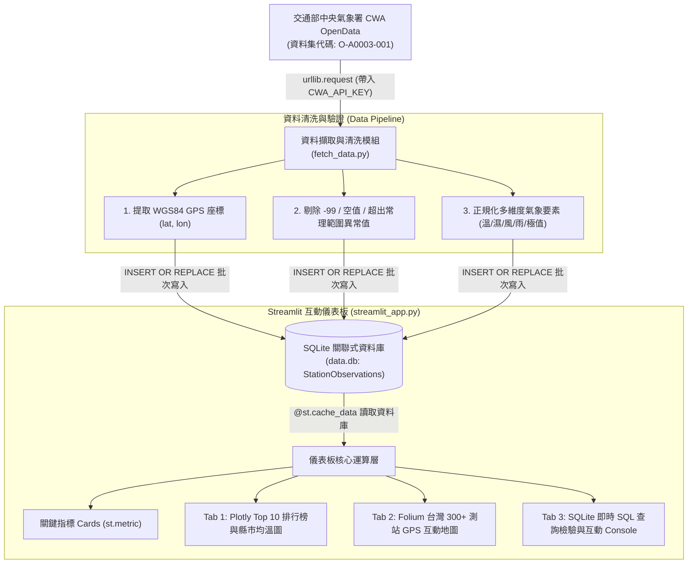

# 🌤️ Taiwan Weather Live Dashboard — 台灣即時天氣觀測與視覺化系統

> **AI 創新微課程：AIoT_L3_CWA_HW1 (進階強化版)**  
> *「用程式探索天氣 · 用真實測站看見台灣 · 用 AI 實現更多可能」*

[](https://www.python.org/)
[](https://streamlit.io/)
[](https://www.sqlite.org/)
[](https://pandas.pydata.org/)
[](https://plotly.com/)
[](https://python-visualization.github.io/folium/)
[](https://opendata.cwa.gov.tw/)

---

## 📌 專案簡介 (Project Overview)

本專案全面升級採用 **交通部中央氣象署 (CWA) `O-A0003-001`（局屬氣象站-現在天氣觀測報告）** 開放資料集。相較於一般預測模型或粗略的行政區代表點，本系統直接擷取全台 **360+ 座氣象觀測站真實地面實測數據**，並結合精準 **WGS84 GPS 經緯度座標**，打造兼具資料工程清洗規範與專業地理資訊呈現的高互動性即時氣象儀表板。

系統包含後端自動清洗資料管線（過濾儀器維護 `-99` 缺測異常值）、SQLite 關聯式資料庫結構設計、全台即時氣溫 Top 10 排行榜、各縣市平均氣溫統計，以及在台灣地圖上動態標註 330+ 測站真實點位之互動地圖（Folium）。

---

## ✨ 核心特色 (Key Features)

- 📡 **氣象署即時觀測 API 串接 (`O-A0003-001`)**：每 10 分鐘同步全台無人與有人測站實測數據，支援 `.env` 授權金鑰環境變數管理。
- 🧹 **健全的資料清洗管線 (Data Cleaning Pipeline)**：
  - 過濾缺測值（如 `""`, `"X"`, `"NA"`, `"-99"`, `"-999"`）。
  - 合理性過濾（氣溫介於 `-20°C ~ 50°C`、經緯度於台灣陸海域合理範圍內）。
  - 全台實測有效站點高達 330+ 座，徹底摒除異常值。
- 💾 **SQLite 資料庫持久化存儲 (`data.db`)**：
  - 設計 `StationObservations` 表格，設定 `UNIQUE(station_id, observed_at)` 避免重繪重複。
  - 支援 `INSERT OR REPLACE` 批次高速寫入與索引查詢。
- 📊 **Streamlit 現代化即時儀表板**：
  - **頂部核心氣象指標**：全台有效測站數、今日最高氣溫測站、今日最低氣溫測站、平均氣溫與相對濕度。
  - **側邊欄智能控制項**：一鍵更新按鈕、22 縣市下拉選單篩選、關鍵字搜尋測站。
  - **Tab 1: 氣溫排行與各縣市統計**：
    - 🔥 全台最高溫 Top 10 測站排行榜（Plotly 水平長條圖）
    - ❄️ 全台最低溫 Top 10 測站排行榜（Plotly 水平長條圖）
    - 🏙️ 各縣市平均氣溫柱狀比較圖
    - 📋 300+ 測站完整多欄位數據明細表
- 🗺️ **Folium 台灣 300+ 測站真實 GPS 互動地圖**：
  - 採用測站實際 WGS84 座標繪製密集圓形標記。
  - 六級動態色階漸變（<15°C 深藍、15-20°C 科技藍、20-25°C 翠綠、25-30°C 琥珀黃、30-35°C 警戒紅、>35°C 極端暗紅）。
  - 點擊 Marker 彈出精美 HTML 卡片：顯示測站名稱、行政區、即時氣溫、相對濕度、風速、時雨量、當日極值與觀測時間。
- 🗄️ **SQLite 即時 SQL 查詢檢驗分頁**：
  - 內建縣市分組聚合查詢（`GROUP BY county`）。
  - 內建高溫排行 SQL 檢視。
  - **互動式 SQL Console**：支援自訂執行 `SELECT` 語句即時檢驗資料庫。

---

## 🏗️ 系統架構與資料流 (Architecture)



---

## 🗄️ 資料庫結構 (Database Schema)

資料庫採用 SQLite：`data.db`

### `StationObservations` 表格欄位定義

| 欄位名稱 (Column) | 資料型態 (Type) | 說明 (Description) | 範例 (Example) |
|---|---|---|---|
| `id` | `INTEGER` | 主鍵，自動遞增 (PRIMARY KEY) | `1` |
| `station_id` | `TEXT NOT NULL` | 測站代碼 | `466940` |
| `station_name` | `TEXT NOT NULL` | 測站名稱 | `基隆`, `玉山` |
| `county` | `TEXT NOT NULL` | 縣市名稱 | `基隆市`, `南投縣` |
| `town` | `TEXT` | 鄉鎮市區 | `仁愛區`, `信義鄉` |
| `lat` | `REAL NOT NULL` | WGS84 緯度 | `25.1333` |
| `lon` | `REAL NOT NULL` | WGS84 經度 | `121.7405` |
| `observed_at` | `TEXT NOT NULL` | 觀測時間 (ISO 8601) | `2026-09-23T10:50:00+08:00` |
| `temperature` | `REAL NOT NULL` | 即時氣溫 (°C) | `27.9` |
| `humidity` | `REAL` | 相對濕度 (%) | `68.0` |
| `wind_speed` | `REAL` | 風速 (m/s) | `4.3` |
| `weather` | `TEXT` | 天氣現象描述 | `晴`, `多雲` |
| `precipitation` | `REAL` | 時雨量 (mm) | `0.0` |
| `daily_high` | `REAL` | 當日最高溫極值 (°C) | `28.0` |
| `daily_low` | `REAL` | 當日最低溫極值 (°C) | `23.7` |
| `created_at` | `TIMESTAMP` | 寫入資料庫時間戳 | `2026-09-23 11:10:13` |

> [!NOTE]
> 表格設定複合唯一約束 `UNIQUE(station_id, observed_at)`，確保定時重複執行資料擷取時能自動覆蓋刷新最新觀測，不會累積重複資料。

---

## 🎨 氣溫色階規範 (Temperature Color Scale)

測站圓形標記與視覺圖表依據實測氣溫進行六級漸變著色：

| 氣溫區間 (°C) | 體感描述 | HEX 色碼 | 色彩代表 |
|:---:|:---:|:---:|:---:|
| **< 15.0°C** | 寒冷 / 高山冷冽 | `#2B6CB0` | 🟦 深邃湛藍 |
| **15.0°C – 20.0°C** | 涼爽舒服 | `#3B82F6` | 🔷 科技蔚藍 |
| **20.0°C – 25.0°C** | 舒適宜人 | `#10B981` | 🟩 森林翠綠 |
| **25.0°C – 30.0°C** | 溫暖微熱 | `#F59E0B` | 🟨 暖陽琥珀 |
| **30.0°C – 35.0°C** | 炎熱酷熱 | `#EF4444` | 🟥 警戒火紅 |
| **> 35.0°C** | 極端高溫 | `#991B1B` | 🟫 極端赭紅 |

---

## 🚀 快速上手指南 (Quick Start)

### 1. 取得專案原始碼
```bash
git clone https://github.com/Jurass4207/AIoT_L3_CWA_HW1.git
cd AIoT_L3_CWA_HW1
```

### 2. 建立虛擬環境並安裝依賴
```bash
# 建立虛擬環境
python -m venv venv

# 啟動虛擬環境 (Windows PowerShell)
.\venv\Scripts\Activate.ps1
# macOS / Linux 使用：source venv/bin/activate

# 安裝所需套件
pip install -r requirements.txt
```

### 3. 配置氣象署 API Key
複製設定檔範本或建立 `.env`：
```bash
cp .env.example .env
```
在 `.env` 中設定您的 CWA 授權碼：
```env
CWA_API_KEY=CWA-4078E566-C632-4356-8C9F-D1B4AE74E894
```

### 4. 執行資料擷取與寫入資料庫
```bash
python fetch_data.py
```
程式將連線中央氣象署拉取 `O-A0003-001`，執行清洗並將 330+ 測站即時觀測存入 `data.db`。

### 5. 啟動 Streamlit 儀表板 (本地端模式，可選)
```bash
pip install -r requirements-streamlit.txt
streamlit run streamlit_app.py
```
啟動完成後，開啟瀏覽器前往 `http://localhost:8501` 即可瀏覽互動式即時天氣儀表板。

### 6. 一鍵部署至 Vercel (雲端模式)
本專案已完全適配 Vercel 原生全端架構（靜態前端 + Python Serverless API）：

1. **推送代碼至 GitHub**：
   ```bash
   git push origin main
   ```
2. **前往 Vercel 建立專案**：
   - 登入 [vercel.com](https://vercel.com/)，點擊 **「Add New...」->「Project」**。
   - 選擇您的 GitHub 儲存庫 `Jurass4207/AIoT_L3_CWA_HW1` 並點擊 **「Import」**。
3. **設定環境變數**：
   - 在 **Environment Variables** 區塊中新增：
     - KEY: `CWA_API_KEY`
     - VALUE: `CWA-4078E566-C632-4356-8C9F-D1B4AE74E894`
4. **點擊「Deploy」**：
   - 等待約 20~30 秒，Vercel 將自動完成部署，並為您產生專屬公開網址（例如 `https://aiot-l3-cwa-hw1.vercel.app`）！

---

## 📂 專案檔案結構 (Project Structure)

```text
weather-forecast/
├── api/
│   └── weather.py          # Vercel Python Serverless Function (GET /api/weather)
├── data/
│   └── latest.json         # 330+ 測站預快取靜態備份 (確保即時首屏秒開)
├── index.html              # Vercel 前端首頁 (全螢幕 Leaflet 氣象地圖)
├── style.css               # 現代極致暗黑玻璃擬態 CSS 樣式
├── app.js                  # 前端互動地圖、圖層切換與 Chart.js 核心邏輯
├── vercel.json             # Vercel 路由設定與專案部署配置
├── streamlit_app.py        # Streamlit 本地互動儀表板主程式
├── fetch_data.py           # CWA O-A0003-001 本地資料擷取與 SQLite 寫入腳本
├── data.db                 # SQLite 氣候資料庫
├── requirements.txt        # Vercel 部署相依套件清單 (輕量快速)
├── requirements-streamlit.txt # Streamlit 本地完整相依套件清單
├── .env.example            # 環境變數設定範本
├── .gitignore              # Git 版本控制忽略檔
└── README.md               # 專案完整說明手冊
```

---

## 🗺️ 學習步驟對應表 (Curriculum Roadmap: 01 ~ 20)

| 步驟編號 | 學習重點任務 | 實作檔案與對應說明 |
|:---:|:---|:---|
| **步驟 01 - 02** | 概念導入與即時觀測價值 | 升級採用 `O-A0003-001` 真實測站觀測架構 |
| **步驟 03** | 取得 CWA API Key | 註冊中央氣象署開放資料平台會員並配置授權金鑰 |
| **步驟 04** | API 資料取得 (HTTP Requests) | `fetch_data.py` 之 `fetch_cwa_observations()` 函式 |
| **步驟 05** | JSON 巢狀結構解析 | 剖析 `records.Station` 與多層氣象元素陣列 |
| **步驟 06** | 提取測站經緯度與各項氣象要素 | 提取 WGS84 座標、即時氣溫、濕度、風速、極值 |
| **步驟 07** | 資料清洗與數值常理驗證 | `parse_station_observations()` 過濾 `-99` 缺測異常值 |
| **步驟 08** | 建立 SQLite 資料庫 (`data.db`) | `fetch_data.py` 之 `init_database()` 建立資料庫 |
| **步驟 09** | 資料庫設計 (`StationObservations`) | 設定欄位型別與 `UNIQUE(station_id, observed_at)` 防重約束 |
| **步驟 10** | 查詢資料驗證 (SQL 檢查) | `verify_database()` 統計縣市測站數與全台高低溫 Top 3 |
| **步驟 11** | Streamlit 入門與頁面配置 | `streamlit_app.py` 現代漸變標題與自訂 CSS 樣式 |
| **步驟 12** | 從 SQLite 讀取即時觀測資料 | `load_observation_data()` 結合 `@st.cache_data` 高效快取 |
| **步驟 13** | 縣市下拉選單與關鍵字搜尋過濾 | 側邊欄 `st.selectbox` 與 `st.text_input` 動態篩選 |
| **步驟 14** | 繪製高低溫 Top 10 與縣市均溫圖 | `Tab 1` 使用 Plotly 繪製水平排行榜長條圖與漸變配色 |
| **步驟 15** | 顯示清晰的 300+ 測站資料表格 | `Tab 1` 條列完整測站明細，支援欄位排序 |
| **步驟 16** | 整合 Web App 關鍵指標與更新按鈕 | 頂部 5 大指標卡 (`st.metric`) 與側邊欄即時更新功能 |
| **步驟 17** | 台灣 300+ 測站即時互動地圖視覺化 | `Tab 2` 整合 Folium 依真實 GPS 經緯度繪製密集點位 |
| **步驟 18** | 動態氣溫色階渲染與詳細 Popup | 六級色階動態著色，點擊彈出含氣溫/濕度/風速之卡片 |
| **步驟 19** | 完整成果展示 (Taiwan Weather Dashboard) | 成果整合與流暢互動體驗 |
| **步驟 20** | 程式碼品質與防呆優化 | 包含 `Tab 3` 互動式 SQL 查詢主控台與自動錯誤防護 |

---

## 💡 延伸應用與未來展望 (Future Enhancements)

1. **空間溫度內插與熱點圖 (Heatmap & IDW Interpolation)**：運用空間反距離加權 (IDW) 演算法，將 300+ 測站離散點位內插為平滑的連續溫度色階等溫線底圖。
2. **極端氣候即時預警**：當特定測站氣溫突破 38°C 或時雨量突破 40mm 時，觸發告警通知。
3. **歷史觀測時間回放**：記錄過去 24 小時每小時之觀測數據，提供使用者透過時間軸滑桿回放全台氣溫變化。

---

## 👨‍🏫 鳴謝與資料來源 (Acknowledgments & License)

- **課程導師**：煥哥（AI 創新微課程）
- **資料來源**：[交通部中央氣象署 開放資料平台 (CWA OpenData O-A0003-001)](https://opendata.cwa.gov.tw/)
- **開源授權**：本專案採用 [MIT License](LICENSE) 授權。