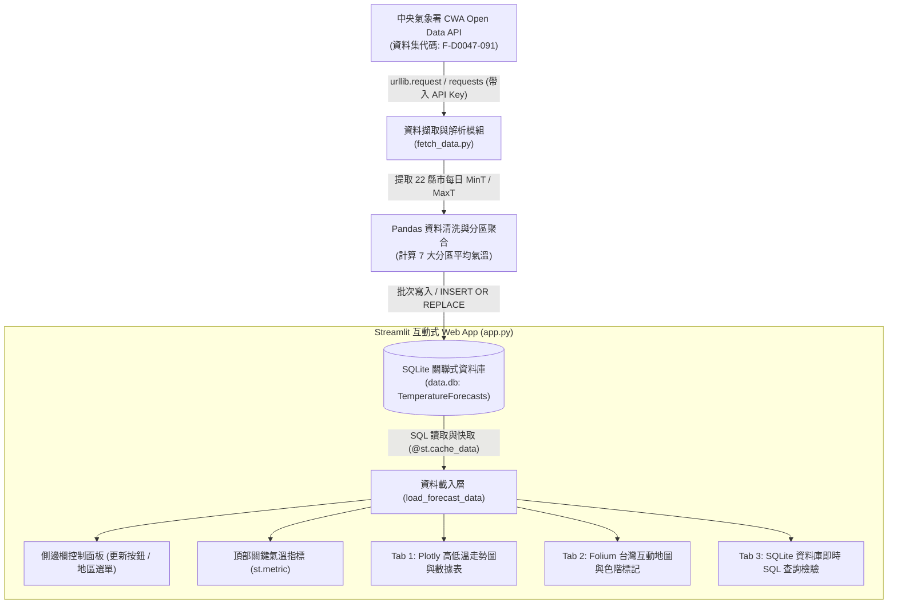

# 🌤️ Taiwan Weather Forecast — 從氣象資料到互動式天氣預報應用

> **AI 創新微課程：AIoT_L3_CWA_HW1**  
> *「用程式探索天氣 · 用資料看見台灣 · 用 AI 實現更多可能」*

[](https://www.python.org/)
[](https://streamlit.io/)
[](https://www.sqlite.org/)
[](https://pandas.pydata.org/)
[](https://plotly.com/)
[](https://python-visualization.github.io/folium/)
[](https://opendata.cwa.gov.tw/)

---

## 📌 專案簡介 (Project Overview)

本專案為 **AIoT_L3_CWA_HW1** 課程作業之完整實作成果。整合 **中央氣象署 (CWA) 開放資料平台 API**、**Python 資料工程清洗**、**SQLite 輕量化關聯式資料庫** 與 **Streamlit 現代互動式 Web App**，打造兼具視覺美感與數據精確度之台灣一週天氣預報儀表板（Taiwan Weather Dashboard）。

使用者可透過側邊欄即時連線中央氣象署抓取最新預報，並利用下拉選單自由切換全台 22 縣市或 7 大代表分區，即時檢視最高與最低氣溫走勢圖、日溫差數據表格，更可切換不同預報日期，透過互動式台灣地圖直觀瀏覽全台風貌。

---

## ✨ 核心特色 (Key Features)

- 📡 **氣象署 CWA API 自動化串接**：串接資料集 `F-D0047-091`（臺灣各縣市未來 1 週天氣預報），支援環境變數與安全金鑰管理。
- 🧹 **資料清洗與分區聚合運算**：運用 Pandas 剖析多層巢狀 JSON 結構，精準擷取最高氣溫 (`MaxT`) 與最低氣溫 (`MinT`)，並自動計算全台 7 大分區平均溫度。
- 💾 **SQLite 關聯式資料庫持久化**：建立 `data.db` 與 `TemperatureForecasts` 表格，設定 `UNIQUE(regionName, dataDate)` 鍵值防重複寫入（支援 `INSERT OR REPLACE`）。
- 📊 **Streamlit 互動式儀表板**：
  - **即時指標卡 (Metrics Cards)**：今日最高溫、最低溫、一週平均氣溫及極端溫差對比。
  - **區域篩選器 (Region Selector)**：下拉選單快速切換 7 大分區與 22 縣市。
  - **雙折線趨勢圖 (Plotly Chart)**：最高溫（紅色）、最低溫（藍色）雙軌曲線並標註數值。
  - **數據總覽表格 (Data Table)**：每日預報數據條列化與自動日溫差計算。
- 🗺️ **Folium 台灣互動地圖**：依預報日期動態渲染各區域代表座標圓形標記，並以四級色階呈現冷熱感受，點擊彈出詳細資訊視窗。
- 🗄️ **SQL 即時查詢驗證分頁**：整合直接查詢資料庫之後台驗證功能，檢視不重複地區與指定區域數據，完整對應課程驗證需求。

---

## 🏗️ 系統架構與資料流 (Architecture)



---

## 🗄️ 資料庫結構 (Database Schema)

資料庫採用 SQLite：`data.db`

### `TemperatureForecasts` 表格欄位定義

| 欄位名稱 (Column) | 資料型態 (Type) | 主鍵/約束 (Constraints) | 說明 (Description) | 範例 (Example) |
|---|---|---|---|---|
| `id` | `INTEGER` | `PRIMARY KEY AUTOINCREMENT` | 記錄流水編號 | `1` |
| `regionName` | `TEXT` | `NOT NULL` | 分區或縣市名稱 | `中部地區`, `臺北市` |
| `dataDate` | `TEXT` | `NOT NULL` | 預報日期 (YYYY-MM-DD) | `2026-09-23` |
| `minT` | `REAL` | `NOT NULL` | 該日最低氣溫 (°C) | `25.3` |
| `maxT` | `REAL` | `NOT NULL` | 該日最高氣溫 (°C) | `32.7` |
| `created_at` | `TIMESTAMP` | `DEFAULT CURRENT_TIMESTAMP` | 寫入資料庫時間戳 | `2026-09-23 10:58:26` |

> [!NOTE]
> 表格設定複合唯一約束 `UNIQUE(regionName, dataDate)`，搭配 `INSERT OR REPLACE` 語句，確保每次更新既能覆蓋最新氣溫資料，又絕不產生重複冗餘紀錄。

---

## 🎨 氣溫色階規範 (Temperature Color Scale)

地圖標記依照區域日平均氣溫進行色階區分，直觀傳遞冷熱感知：

| 氣溫區間 (°C) | 體感描述 | HEX 色碼 | 色彩代表 |
|:---:|:---:|:---:|:---:|
| **< 20.0°C** | 寒冷 / 涼爽 | `#3B82F6` | 🟦 科技蔚藍 |
| **20.0°C – 25.0°C** | 舒適宜人 | `#10B981` | 🟩 森林翠綠 |
| **25.0°C – 30.0°C** | 溫暖 / 微熱 | `#F59E0B` | 🟨 暖陽琥珀 |
| **> 30.0°C** | 酷熱高溫 | `#EF4444` | 🟥 警戒火紅 |

---

## 🚀 快速上手指南 (Quick Start)

### 1. 取得專案程式碼
```bash
git clone https://github.com/Jurass4207/AIoT_L3_CWA_HW1.git
cd AIoT_L3_CWA_HW1
```

### 2. 建立虛擬環境並安裝依賴
```bash
# 建立虛擬環境
python -m venv venv

# 啟動虛擬環境 (Windows PowerShell)
.\venv\Scripts\Activate.ps1
# macOS / Linux 使用：source venv/bin/activate

# 安裝所需套件
pip install -r requirements.txt
```

### 3. 設定氣象署 CWA API Key
專案支援由環境變數或 `.env` 檔案載入授權碼：
```bash
# 複製設定檔範本
cp .env.example .env
```
在 `.env` 中填入您的授權碼（或直接使用預設配置）：
```env
CWA_API_KEY=CWA-4078E566-C632-4356-8C9F-D1B4AE74E894
```

### 4. 執行資料擷取與寫入資料庫
```bash
python fetch_data.py
```
執行後將自動連線中央氣象署抓取最新預報，並在終端機輸出資料庫驗證成果。

### 5. 啟動 Streamlit 儀表板
```bash
streamlit run app.py
```
啟動成功後，瀏覽器前往 `http://localhost:8501` 即可操作完整互動式天氣儀表板。

---

## 📂 專案檔案結構 (Project Structure)

```text
weather-forecast/
├── .env.example            # 環境變數設定範本 (包含 CWA API Key 說明)
├── .gitignore              # Git 版本控制忽略檔 (排除 .env, venv 等)
├── README.md               # 專案完整說明與作業規範文件
├── requirements.txt        # 專案相依套件清單 (requests, pandas, streamlit, folium, plotly)
├── fetch_data.py           # 氣象署 CWA API 擷取、資料清洗與 SQLite 寫入腳本
├── app.py                  # Streamlit 視覺化主程式 (含圖表、互動地圖與 SQL 驗證)
├── data.db                 # SQLite 氣候資料庫 (存放 TemperatureForecasts 表格)
└── workflow.md             # 系統架構與資料流詳細手冊
```

---

## 🗺️ 學習步驟對應表 (Curriculum Roadmap: 01 ~ 20)

本專案完全對應 **AIoT_L3_CWA_HW1** 課程 20 大步驟：

| 步驟編號 | 學習重點任務 | 實作檔案與對應說明 |
|:---:|:---|:---|
| **步驟 01 - 02** | 概念導入與氣象資料價值 | 專案發想與核心架構設計 |
| **步驟 03** | 取得 CWA API Key | 註冊中央氣象署開放資料平台會員並配置金鑰 |
| **步驟 04** | API 資料取得 (HTTP Requests) | `fetch_data.py` 之 `fetch_cwa_forecast()` 函式 |
| **步驟 05** | JSON 巢狀結構解析 | 拆解 `Locations -> Location -> WeatherElement` |
| **步驟 06** | 提取最高與最低氣溫 (MinT / MaxT) | `parse_temperature_data()` 整合 12 小時區間溫度 |
| **步驟 07** | 資料整理與分區彙整 (Pandas) | 計算北部、中部、南部、東部等 7 大分區平均溫度 |
| **步驟 08** | 建立 SQLite 資料庫 (`data.db`) | `fetch_data.py` 之 `init_database()` 建立資料庫 |
| **步驟 09** | 資料庫設計 (`TemperatureForecasts`) | 定義欄位、資料型別與 `UNIQUE` 防重複插入約束 |
| **步驟 10** | 查詢資料驗證 (SQL 檢查) | `verify_database()` 執行 DISTINCT 與中部地區示範查詢 |
| **步驟 11** | Streamlit 入門與頁面配置 | `app.py` 基礎 `set_page_config` 與精美客製 CSS |
| **步驟 12** | 從 SQLite 資料庫讀取資料 | `load_forecast_data()` 配合 `@st.cache_data` 高效快取 |
| **步驟 13** | 下拉選單選擇地區 | 側邊欄 `st.selectbox` 排序分區與縣市 |
| **步驟 14** | 繪製一週最高與最低氣溫折線圖 | `Tab 1` 使用 Plotly 繪製雙色平滑曲線與溫度數值標記 |
| **步驟 15** | 顯示清晰的一週資料表格 | `Tab 1` 條列每日高低溫、自動換算日溫差 |
| **步驟 16** | 整合 Web App 介面 | 指標卡 (`st.metric`)、側邊欄即時更新按鈕整合 |
| **步驟 17** | 台灣地圖視覺化 (Folium + Streamlit) | `Tab 2` 整合 Folium 繪製台灣地圖與 4 級色彩標記 |
| **步驟 18** | 選擇日期顯示動態氣象地圖 | 日期選擇選單動態更新全台測站溫度與 Popup 視窗 |
| **步驟 19** | 完整成果展示 (Taiwan Weather Dashboard) | 成果整合與流暢互動體驗 |
| **步驟 20** | 程式碼品質與優化 | 例外捕捉、編碼相容性處理、模組化重構 |

---

## 💡 延伸應用與未來展望 (Future Enhancements)

1. **AI 天氣穿搭與生活建議**：串接大型語言模型 (如 Gemini API)，依據今日溫差與天氣狀況自動生成個人化出門穿搭與行程提示。
2. **LINE Bot 晨間氣象推播**：排程每日清晨 7:00 自動推播當日即時溫度與降雨預報給使用者。
3. **智慧農漁業低溫/高溫特報**：設定警戒溫度閾值（如低於 12°C 寒害防護），自動觸發告警通知。

---

## 👨‍🏫 鳴謝與資料來源 (Acknowledgments & License)

- **課程導師**：煥哥（AI 創新微課程）
- **資料來源**：[交通部中央氣象署 開放資料平台 (CWA OpenData)](https://opendata.cwa.gov.tw/)
- **開源授權**：本專案採用 [MIT License](LICENSE) 授權。