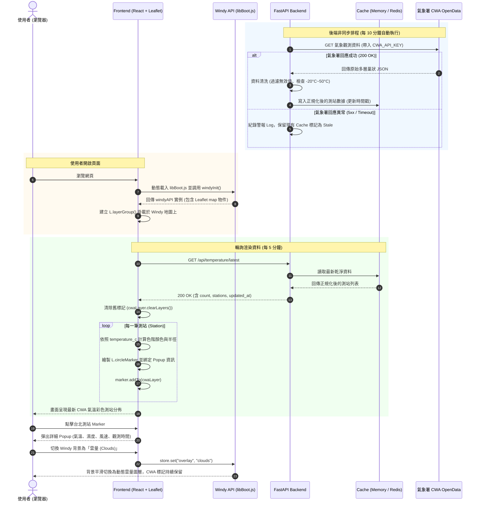
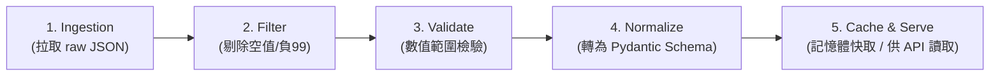
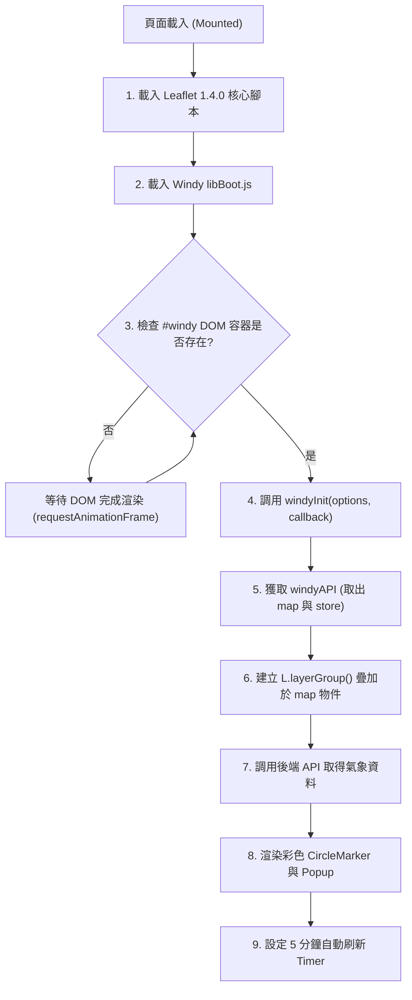
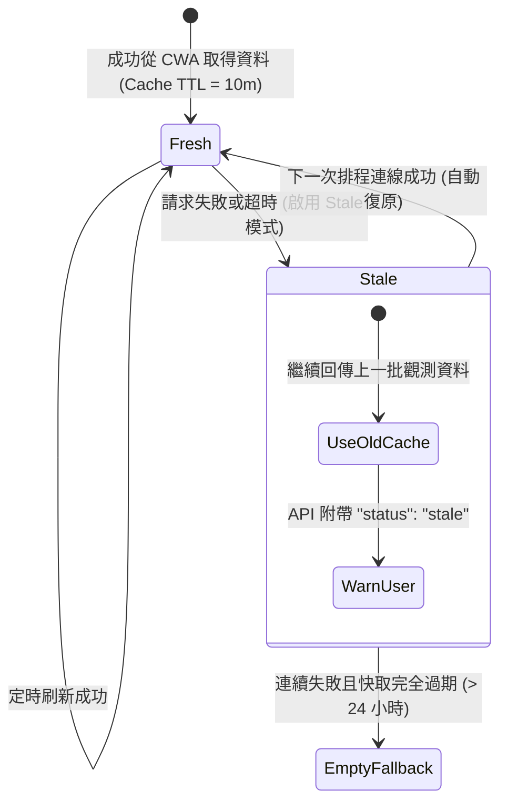
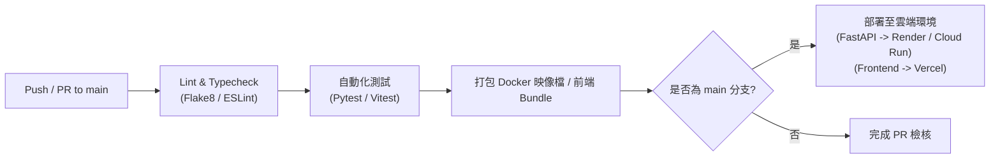

# 🔄 Taiwan CWA × Windy 視覺化系統工作流程手冊 (workflow.md)

> 本文件詳細說明 **Taiwan CWA Temperature Visualization with Windy API** 專案的資料流轉機制、開發標準規範、測試驗證流程、部署管道以及維運故障排除指南。

---

## 📑 目錄

1. [系統核心運作流程 (System & Data Flow)](#1-系統核心運作流程-system--data-flow)
   - [1.1 完整時序互動圖 (End-to-End Sequence Diagram)](#11-完整時序互動圖-end-to-end-sequence-diagram)
   - [1.2 資料管線生命週期 (Data Pipeline Lifecycle)](#12-資料管線生命週期-data-pipeline-lifecycle)
   - [1.3 前端地圖初始化與圖層掛載流 (Frontend Initialization)](#13-前端地圖初始化與圖層掛載流-frontend-initialization)
2. [快取與容錯回退機制 (Cache & Fallback Mechanism)](#2-快取與容錯回退機制-cache--fallback-mechanism)
3. [日常開發與協作流程 (Development Workflow)](#3-日常開發與協作流程-development-workflow)
   - [3.1 Git 分支與 Commit 規範](#31-git-分支與-commit-規範)
   - [3.2 本地開發環境快速啟動 SOP](#32-本地開發環境快速啟動-sop)
   - [3.3 新增觀測指標 (Feature Extension Guide)](#33-新增觀測指標-feature-extension-guide)
4. [測試與驗證流程 (Testing & QA Workflow)](#4-測試與驗證流程-testing--qa-workflow)
5. [CI/CD 自動化與部署流程 (CI/CD & Deployment)](#5-cicd-自動化與部署流程-cicd--deployment)
6. [異常監控與故障排除 SOP (Troubleshooting Runbook)](#6-異常監控與故障排除-sop-troubleshooting-runbook)

---

## 1. 系統核心運作流程 (System & Data Flow)

系統運作分為兩大獨立非同步核心：**後端資料定時擷取管線** 與 **前端瀏覽器互動渲染**。

### 1.1 完整時序互動圖 (End-to-End Sequence Diagram)



---

### 1.2 資料管線生命週期 (Data Pipeline Lifecycle)

後端資料進入與清洗流程分為五個階段：



1. **Ingestion（擷取）**：透過 `httpx.AsyncClient` 呼叫中央氣象署 `O-A0003-001`（或有人/無人測站整合資料集）。
2. **Filter（初步過濾）**：
   - 移除經緯度遺失或無測站代碼的紀錄。
   - 攔截 `AirTemperature` 內的值，若為 `["", "X", "NA", "null", "-99", "-999"]` 則標記為無效。
3. **Validate（數值檢驗）**：
   - 溫度數值範圍必須落在合理區間：`-20.0 <= temp <= 50.0`。
   - 經緯度座標必須落在台灣地區及離島經緯度邊界內。
4. **Normalize（資料正規化）**：
   - 將原始鍵值映射為標準 Pydantic 模型 `StationTemperature`。
   - 時間轉換為標準 ISO 8601 格式（包含 `+08:00` 台灣時區）。
5. **Cache & Serve（快取與發布）**：
   - 儲存於記憶體或 Redis，預設 TTL 為 600 秒（10 分鐘）。
   - 對外提供 `/api/temperature/latest` 及 `/api/temperature/geojson`。

---

### 1.3 前端地圖初始化與圖層掛載流 (Frontend Initialization)

Windy 與 Leaflet 的掛載順序至關重要，必須遵循嚴格順序以避免 DOM 衝突：



---

## 2. 快取與容錯回退機制 (Cache & Fallback Mechanism)

氣象署 OpenData 有時因維護或流量尖峰出現瞬斷，系統必須保持「**服務不中斷、前端不報錯**」的韌性設計。



- **正常狀態 (`fresh`)**：後端回傳 HTTP 200，資料時間戳為最新一小時。
- **快取退避 (`stale`)**：若 CWA 拋出 500 或 Timeout，後端將自動提供最新一份快取，並在 HTTP 回應中標註 `"cwa_cache_status": "stale"`。
- **前端友善提示**：前端收到 stale 狀態時，於導覽列顯示提示：*「氣象署即時資料通訊中，目前顯示快取觀測資料 (HH:mm)」*，不會阻斷使用者瀏覽地圖。

---

## 3. 日常開發與協作流程 (Development Workflow)

### 3.1 Git 分支與 Commit 規範

本專案採用 **GitHub Flow** 輕量分支模型：

- `main`：正式可發布穩定版本，所有變更皆須透過 PR 合併。
- `feature/<feature-name>`：新功能開發分支（如：`feature/heatmap-layer`）。
- `fix/<bug-name>`：問題修復分支（如：`fix/cwa-missing-data`）。

#### Commit 訊息規範 (Conventional Commits)

格式範例：`feat(api): add geojson endpoint for leaflet compatibility`

| 前綴詞 | 適用情境 |
|---|---|
| `feat` | 新增功能（後端端點、前端圖層等） |
| `fix` | 修復程式錯誤或數值異常 |
| `docs` | 文件異動（README.md, workflow.md） |
| `style` | 不影響邏輯的排版、空格或格式調整 |
| `refactor`| 重構程式碼（無功能改變） |
| `perf` | 效能調校（例如減少重繪、導入 Canvas） |
| `test` | 新增或修改單元測試/整合測試 |

---

### 3.2 本地開發環境快速啟動 SOP

#### 步驟 1：Clone 專案並進入專案目錄
```bash
git clone https://github.com/Jurass4207/AIoT_L3_CWA_HW1.git
cd AIoT_L3_CWA_HW1
```

#### 步驟 2：後端設定 (FastAPI)
```bash
cd backend
python -m venv venv
.\venv\Scripts\Activate.ps1    # macOS/Linux: source venv/bin/activate
pip install -r requirements.txt
cp .env.example .env

# 填入您的 CWA API Key
# 啟動熱重載伺服器 (埠號 8000)
uvicorn app.main:app --reload --port 8000
```

#### 步驟 3：前端設定 (React + Vite)
另開終端機視窗：
```bash
cd frontend
npm install
cp .env.example .env.local

# 填入您的 WINDY API Key
# 啟動前端開發伺服器
npm run dev
```

#### 步驟 4：瀏覽器測試
- 前端應用：開啟 `http://localhost:5173`
- 後端 Swagger 文件：開啟 `http://localhost:8000/docs`

---

### 3.3 新增觀測指標 (Feature Extension Guide)

若要新增其他觀測指標（例如：**降雨量 Precipitation** 或 **相對濕度 Humidity**）：

1. **後端資料結構修改**：
   - 編輯 `backend/app/schemas/temperature.py`，確認 Pydantic 包含新欄位。
   - 在 `backend/app/services/temperature_service.py` 加入對應欄位的清洗與轉換邏輯。
2. **提供專屬 API 或擴充現有端點**：
   - 更新 `/api/temperature/latest` 回傳物件，確保欄位包含於 JSON 回應中。
3. **前端視覺化渲染**：
   - 於 `frontend/src/lib/colorScale.ts` 撰寫專屬色階對照表（例如雨量色階）。
   - 於 `frontend/src/components/LayerControlPanel.tsx` 增加切換選項。
   - 更新 `StationPopup.tsx` 顯示新指標數據。

---

## 4. 測試與驗證流程 (Testing & QA Workflow)

提交 PR 前，必須依序通過以下測試檢驗：

### 4.1 後端測試 (Pytest)

```bash
cd backend
# 執行單元測試與端點測試
pytest tests/ -v

# 程式碼風格與型別檢查
flake8 app/
mypy app/
```

- **重點測試項目**：
  - [x] 測試 CWA 原始 JSON 遇到異常 `-99` 數值是否會被正確認為 `None`。
  - [x] 測試極端溫度（如 `60°C` 或 `-30°C`）是否會被驗證器過濾掉。
  - [x] 測試快取是否能在時間內正常命中並回傳。
  - [x] 模擬 CWA API 回應 500 時，後端是否能優雅切換為 stale 快取回傳。

### 4.2 前端測試 (Lint & Type Check)

```bash
cd frontend
# 執行 TypeScript 型別檢查
npm run type-check

# 執行 ESLint 語法檢查
npm run lint

# 執行組件測試
npm run test
```

---

## 5. CI/CD 自動化與部署流程 (CI/CD & Deployment)

本專案建議透過 **GitHub Actions** 實現持續整合與自動化部署：



### 推薦部署架構

| 元件 | 推薦託管平台 | 備註說明 |
|---|---|---|
| **後端 FastAPI** | Render / Fly.io / GCP Cloud Run | 提供 Dockerfile 容器化，內建排程背景任務 |
| **快取層** | Upstash Redis (Serverless) / 內建記憶體 | 用於跨多實例時的快取同步 |
| **前端應用** | Vercel / Cloudflare Pages | 靜態資源 Edge 部署，具備全球 CDN 快取 |

---

## 6. 異常監控與故障排除 SOP (Troubleshooting Runbook)

當系統發生告警或畫面異常時，請參照以下步驟依序排查：

### 情境 1：地圖無法顯示，呈現灰色空白
- **可能原因**：Windy API Key 無效、網域名稱未授權、或 Leaflet/libBoot.js 載入失敗。
- **排除步驟**：
  1. 開啟瀏覽器開發者工具 (F12) 查看 Console 錯誤。
  2. 若出現 `Windy API key invalid`，請檢查 `frontend/.env.local` 中的 `NEXT_PUBLIC_WINDY_API_KEY` 是否正確。
  3. 檢查 Windy 官網帳號後台，確認當前開發網址（如 `localhost` 或自訂網域）已加入 Allowed Domains 白名單。

### 情境 2：地圖正常載入，但看不到 CWA 測站標記
- **可能原因**：後端未啟動、CORS 被擋、或氣象署 API Key 失效。
- **排除步驟**：
  1. 於瀏覽器直接開啟 `http://localhost:8000/api/health`，確認健康狀態。
  2. 檢查 `http://localhost:8000/api/temperature/latest` 是否有回傳正確的測站陣列。
  3. 若後端回傳 500，檢視後端終端機日誌：
     - 若為 `401 Unauthorized`：代表 `CWA_API_KEY` 錯誤或已過期，請至氣象署會員中心重新取得。
     - 若為 `CORS error`：檢查 `backend/.env` 的 `ALLOWED_ORIGINS` 是否有加入前端網址。

### 情境 3：部分測站溫度顯示 `-` 或顏色反白
- **可能原因**：該測站正在進行例行儀器維護，氣象署回傳缺測標記。
- **排除步驟**：
  1. 此為預期保護行為（資料管線已將無效數值轉換為 `None`），防止異常極值干擾全台色階渲染。
  2. 確認該測站的 Popup 視窗正常顯示「溫度：- °C」，而非導致前端頁面當機。

---

*文件維護人：專案開發團隊*  
*最後修訂時間：2026 年*
